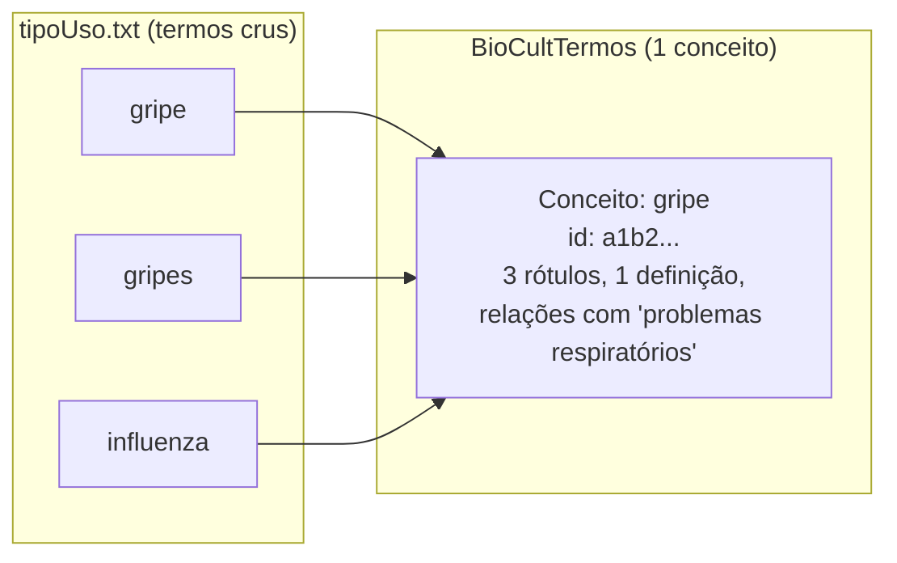

# 2. Termo × Conceito: a distinção fundamental {#s2}

Esta é **a** ideia central do manual. Se você entender só isto, já usa o sistema muito melhor.

- **Termo** é uma *palavra ou expressão* — um pedaço de texto. O arquivo `tipoUso.txt` é uma
  lista de **termos crus**: `alimentício`, `dor de cabeça`, `febre`, `gripe`, `ritual`,
  `artesanato`... São só strings, sem significado organizado ainda.

- **Conceito** é uma *ideia* — uma unidade de significado, com identidade própria (um
  identificador único no banco). Um conceito pode ter **vários** termos como nome, uma
  definição, notas, e relações com outros conceitos.

> **Analogia:** pense num verbete de dicionário. A *palavra* impressa no topo é o termo; o
> *verbete inteiro* (com definição, sinônimos, exemplos, remissões a outros verbetes) é o
> conceito. Vários termos diferentes podem levar ao mesmo verbete.

Quando o BioCultDB coleta um artigo científico e encontra o uso `gripes`, ele não sabe ainda
se isso é um conceito novo ou apenas o plural de `gripe`. Então ele cria um **conceito
candidato** e deixa a decisão para você, curador. Seu trabalho é transformar a lista bruta de
termos numa **rede organizada de conceitos**.

**Regra de ouro:** três termos que significam a mesma coisa devem virar **um conceito com três
rótulos**, e não três conceitos separados.

## 2.1 A escala disso, com dados reais {#s2-1}

Na campanha do campo "Tipos de Usos de Plantas", a regra de ouro não é teoria — é o que aconteceu
com a maioria dos 713 termos. Os maiores agrupamentos:

| Conceito | Absorveu | Alguns dos termos |
|---|---:|---|
| `problemas renais` | 15 | `rim`, `rins`, `problema renal`, `problemas urinários`, `uropatia`, `vias urinárias` |
| `alimentar` | 11 | `alimentação`, `alimentício`, `alimento`, `comida`, `cozinha`, `fome` |
| `pressão alta` | 10 | `hipertensão`, `baixar a pressão`, `high blood pressure`, `regular a pressão` |
| `dor no estômago` | 7 | `dor de estômago`, `dor de estomago`, `dores estomacais`, `stomache` |
| `cicatrizante` | 7 | `cicatrizar`, `cicatrização`, `cicatrizar feridas`, `healing` |

**381 dos 713 termos eram nome de algo que já existia** — não conceito novo.
