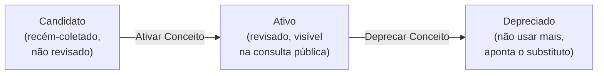

# 5. O ciclo de vida de um conceito (status) {#s5}

Todo conceito passa por três estados. Na tela de edição, a seção **"Ações de Status"** mostra
os botões conforme o estado atual.

- **Candidato** — todo termo que o BioCultDB coleta entra assim. Ainda **não aparece** na
  consulta pública. É a fila de trabalho do curador.
- **Ativo** — depois que você revisou rótulos, definição e relações, clique em **"Ativar
  Conceito"**. A partir daí ele é consultável publicamente (respeitando o `accessLevel` de cada
  rótulo).
- **Depreciado** — quando um conceito não deve mais ser usado (foi duplicado, corrigido ou
  substituído). É **obrigatório** informar o conceito substituto ("Substituído por"). A
  depreciação **exige** um substituto, e daí nasce uma consequência de desenho que você vai
  encontrar: termos sem substituto legítimo (`outros`, `dúvida`, `não especificado`,
  `sem uso reportado`, `corpo`, `peito`, `pernas`, `doenças`, `enferrujado`, `catuaba`) precisam
  de um destino terminal explícito. A campanha criou a faceta **`indeterminado`** para isso, que
  absorveu 10 termos. A alternativa — deixá-los `candidate` para sempre — é erro
  ([§11](11-erros-comuns.md#s11)).

> **Proteção contra conflito:** se duas pessoas editam o mesmo conceito ao mesmo tempo, quem
> salvar por último recebe um aviso de conflito (o sistema não sobrescreve o trabalho da outra
> pessoa silenciosamente). Basta recarregar e refazer sobre a versão atual.

## 5.1 O que acontece com um conceito depreciado {#s5-1}

Ele **mantém o prefLabel** — é uma lápide, não um apagamento — e a consulta responde por ele:
verificado em produção, `GET` do id de `gripes` devolve **`410` com `replacedBy` = `gripe`**.
Nenhum conceito é apagado no BioCultTermos.

## 5.2 O que a aquisição faz com o seu trabalho {#s5-2}

Contexto operacional que todo curador precisa: a aquisição re-semeia os termos do BioCultDB a
cada execução; ela reconhece um termo já existente procurando-o em **preferenciais, alternativos
e ocultos**, então um termo recolhido como rótulo **não volta** como conceito novo. Ela roda **só
sob demanda**, no botão "Executar Aquisição" do dashboard admin — não existe execução agendada.

**Curar com um ciclo no ar é seguro** — verificado por teste: nenhum `409`, nenhuma escrita
perdida — e um segundo ciclo simultâneo é recusado pela própria interface.

A prova: depois da curadoria, um ciclo completo disparado à mão devolveu **`criados=0`** e
contagens idênticas.
