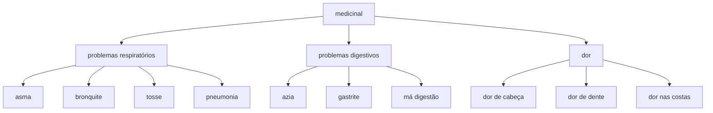
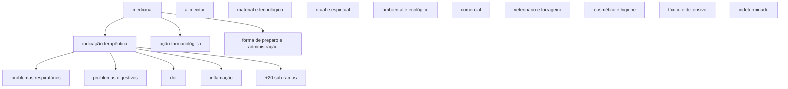

# 6. Relações semânticas: conectando conceitos {#s6}

Aqui está o coração da organização. A seção **"Relações Semânticas"** liga **um conceito a
outro conceito** (nunca a um rótulo). Existem quatro tipos de relação, cada um com um significado
preciso.

### 6.1 Mais amplo (BT) e Mais específico (NT) — hierarquia {#s6-1}

A relação hierárquica diz que um conceito é um **caso particular** de outro. É a relação de
"tipo de / parte de".

- **Mais amplo (BT)** = *Broader Term* — aponta para o conceito mais geral (o "pai").
- **Mais específico (NT)** = *Narrower Term* — o inverso, o conceito mais particular (o "filho").

Elas são **recíprocas automáticas**: se você marca que `dor de cabeça` tem como *mais amplo*
`dor`, o sistema já registra que `dor` tem `dor de cabeça` como *mais específico*.

O `tipoUso.txt` está cheio de hierarquias esperando para ser montadas:

Todos esses termos existem na lista: `medicinal` (299), `problemas respiratórios` (374),
`asma` (19), `bronquite` (32), `tosse` (425), `pneumonia` (347), `problemas digestivos` (359),
`azia` (22), `gastrite` (232), `má digestão` (308), `dor` (138), `dor de cabeça` (140),
`dor de dente` (141), `dor nas costas` (152). Montar essa árvore é o que permite, no futuro,
responder *"quais plantas tratam problemas respiratórios?"* e receber também as que só constam
como tratando "asma" ou "tosse".

> **Cuidado com ciclos:** um conceito não pode ser, ao mesmo tempo, ancestral e descendente de
> outro. O sistema bloqueia isso automaticamente (você veria um aviso de "ciclo hierárquico").

**A árvore que foi realmente construída**, na curadoria de "Tipos de Usos de Plantas": uma árvore
só, **dez facetas de 1º nível**, profundidade máxima 4, poli-hierarquia onde o significado exige,
318 relações `broader`.

As dez facetas: `alimentar`, `ambiental e ecológico`, `comercial`, `cosmético e higiene`,
`indeterminado`, `material e tecnológico`, `medicinal`, `ritual e espiritual`,
`tóxico e defensivo`, `veterinário e forrageiro`.

Doenças ficam **sob `medicinal`**, não num campo semântico separado: a alternativa exigiria mudar
o conjunto de campos monitorados pela aquisição e a origem do dado no BioCultDB, e não se
justifica — a distinção que importa (indicação × ação farmacológica, [§6.5](#s6-5)) já cabe dentro
de `medicinal`.

### 6.2 Relacionado (RT) — associação entre iguais {#s6-2}

**Relacionado (RT)** = *Related Term* liga dois conceitos **distintos e igualmente válidos**,
que se associam por contexto — sem que nenhum seja "tipo de" o outro nem mais correto que o
outro. É uma relação **simétrica** (vale nos dois sentidos).

Exemplos do `tipoUso.txt`:

- `gripe` (236) **relacionado a** `resfriado` (392) — quadros diferentes, frequentemente
  confundidos e tratados com as mesmas plantas; conectá-los ajuda a consulta. Mas **não** são a
  mesma coisa (não use sinônimo) nem um é tipo do outro (não use hierarquia).
- `verme` (443) **relacionado a** `vermicida` (445) — um é a doença/parasita, o outro é o efeito
  da planta; associados, mas conceitos distintos.

A campanha de 713 termos **não criou nenhuma relação RT** — o plano não as previa — e
`gripe` ↔ `resfriado` segue sendo o candidato óbvio da próxima passada. Serve de exemplo honesto:
RT é opcional, hierarquia e rótulo não.

### 6.3 Sinônimo de (aceito) — equivalência com um termo preferido {#s6-3}

Esta relação é a que exige mais atenção, porque é fácil confundir com **rótulo alternativo**
([veja o §7](07-guia-de-decisao.md#s7)). Use **"Sinônimo de (aceito)"** quando dois conceitos **já
existem separadamente** no banco, significam a mesma coisa, e você quer marcar que **um é o termo
aceito** e o outro é apenas um sinônimo dele — **sem apagar nenhum dos dois** (para preservar o
histórico e a proveniência de cada um).

- A relação é **direcionada**: parte do sinônimo e aponta para o conceito aceito.
- O conceito aceito exibe seus sinônimos em **"Sinônimos deste conceito"** (somente leitura).

Exemplo: suponha que a coleta criou, de artigos diferentes, os conceitos separados
`tranquilizante` (427) e `calmante` (38). Você decide que `calmante` é o termo preferido. Então,
na edição de `tranquilizante`, adicione **"Sinônimo de (aceito)"** → `calmante`. Pronto:
`tranquilizante` fica marcado como sinônimo, e `calmante` passa a listá-lo entre seus sinônimos.

> **Por que esta relação existe, se o SKOS puro trataria sinônimos como rótulos?**
> Porque, quando dois conceitos **já foram curados separadamente** (cada um com sua definição,
> notas e proveniência vindas de fontes distintas), transformá-los num conceito só apagaria essa
> história. A relação de sinônimo os reconcilia **sem destruir** o registro de origem de cada um.
> Ainda assim, **o padrão recomendado é evitar chegar nessa situação** — [veja o §7](07-guia-de-decisao.md#s7).

Evidência real: em 713 termos crus, **zero** relações de sinônimo se justificaram, porque termo
cru não tem definição, nota nem proveniência própria a preservar. Confirma a preferência do
[§7](07-guia-de-decisao.md#s7): um conceito com vários rótulos.

### 6.4 A regra que impede contradição {#s6-4}

Dois conceitos ligados por **Sinônimo** **não podem** também ser ligados por **Relacionado (RT)**
— o sistema recusa. Faz sentido: "Relacionado" afirma *"somos dois conceitos igualmente
válidos"*; "Sinônimo" afirma o oposto, *"um de nós é o preferido, o outro não"*. As duas
relações sobre o mesmo par seriam contraditórias. Pela mesma lógica, um conceito não pode ser
sinônimo de si mesmo, nem dois conceitos podem ser sinônimos recíprocos um do outro (só um lado
pode ser o "aceito").

## 6.5 Indicação terapêutica × ação farmacológica {#s6-5}

O erro mais frequente do corpus bruto: `febre` é o que a pessoa **tem**, `antitérmico` é o que a
planta **faz** — conceitos diferentes, **ramos irmãos** sob `medicinal`, nunca o mesmo conceito
nem hierarquia entre si.

Pares reais para reconhecer o padrão: `febre`/`antitérmico`, `gripe`/`antigripal`,
`verme`/`vermífugo`, `inflamação`/`anti-inflamatório`, `insônia`/`sedativo`,
`prisão de ventre`/`laxante`.

O caso mais fino, decidido pelo curador: **`sedação` não é rótulo de `sedativo`** — `sedação` é o
estado obtido, `sedativo` é a propriedade atribuída à planta; absorver um no outro apagaria a
distinção.

Há ainda um terceiro ramo sob `medicinal`, **`forma de preparo e administração`**, onde ficam
`banho`, `chá`, `emplastro`, `xarope` — via de administração, não indicação nem ação.
