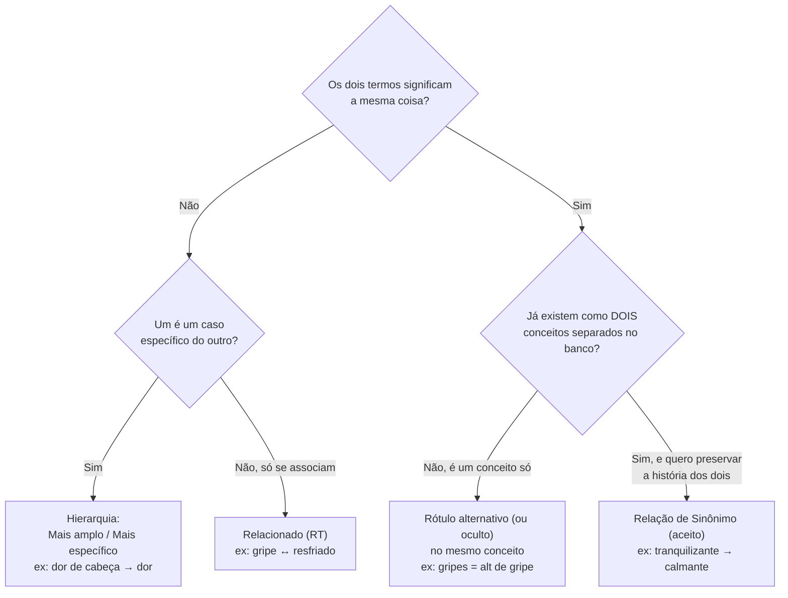
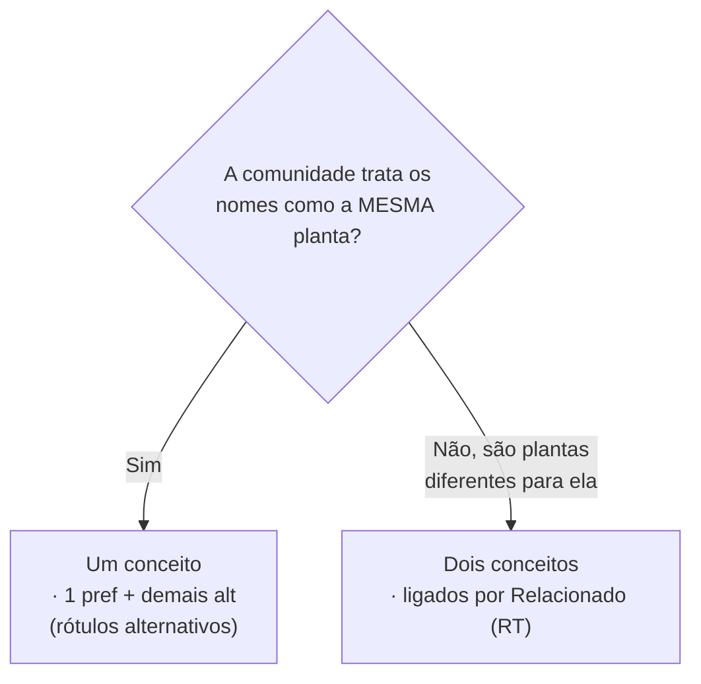
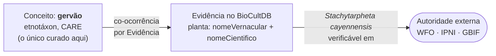

# 7. Guia de decisão: qual mecanismo usar? {#s7}

Esta é a pergunta que mais gera dúvida: *"os termos X e Y são a mesma coisa — uso rótulo
alternativo ou relação de sinônimo? E se não forem a mesma coisa?"*

A diferença crucial é de **nível**:

- **Rótulo alternativo** = outro nome para a **MESMA linha** do banco (o mesmo conceito, o mesmo
  `id`). Não cria nada novo — só acrescenta um nome ao conceito que você está editando.
- **Relação de sinônimo** = **UMA linha apontando para outra** (dois conceitos, dois `id`s, cada
  um com sua própria definição e história).

Fluxo de decisão para dois termos parecidos:

A mesma decisão, na ordem em que a curadoria do campo "Tipos de Usos de Plantas" aplicou cada
teste:

| Situação no corpus | Decisão | Exemplo |
|---|---|---|
| Plural do mesmo termo | rótulo **alternativo** | `gripes` → `gripe` |
| Variante de regência | rótulo **alternativo** | `dor de estômago`, `dores estomacais` → `dor no estômago` |
| Grafia incorreta ou pré-Acordo | rótulo **oculto** | `diarréia`, `gazes`, `hemorróidas` |
| Termo em inglês | rótulo **alternativo**, `language: eng` | `headache` → `dor de cabeça` |
| Caso específico de outro | **hierarquia** (`broader`) | `dor de cabeça` → `dor` |
| Distintos mas associados | **relacionado (RT)** | `gripe` ↔ `resfriado` |
| Termo composto (nomeia dois conceitos) | **rótulo oculto nos dois** + depreciar apontando o primeiro ([§7.4](#s7-4)) | `gripe e tosse` → oculto em `gripe` e em `tosse` |
| Qualificador colado (um conceito + detalhe do artefato) | **depreciar** apontando o núcleo ([§7.5](#s7-5)) | `construção (caibros e ripas…)` → `construção` |
| Sem conteúdo informativo | **depreciar** → `indeterminado` | `outros`, `dúvida` |
| Pertence a outro campo | **não tocar** ([§7.6](#s7-6)) | `fumo` |

**Preferência recomendada:** sempre que possível, prefira **um conceito com vários rótulos** em
vez de vários conceitos ligados por sinônimo. A relação de sinônimo é a **exceção** (para quando
juntar apagaria proveniência), não a regra. Um vocabulário com muitos conceitos "sinônimos" uns
dos outros, quando poderiam ser um só, é mais difícil de manter.

### 7.1 O caso clássico: trocar qual rótulo é o preferido {#s7-1}

Situação real: o conceito foi criado com o preferencial `alimentação`, mas você decide que o
termo preferido deveria ser `alimentar` (ou o inverso). Você **não** troca o tipo do rótulo
diretamente (isso deixaria o conceito sem nenhum preferencial por um instante). O fluxo correto:

1. Adicione o novo nome como rótulo **Alternativo** (formulário "+ Adicionar Rótulo").
2. No card desse novo rótulo, clique em **"★ Tornar Preferencial"**.

O sistema promove o novo a preferencial e rebaixa o antigo a alternativo **na mesma operação**,
sem nunca passar por um estado inválido. Tudo continua sendo **um conceito só**.

### 7.2 Nomes vernaculares do mesmo conceito: alternativo, não relacionado {#s7-2}

Dois ou mais nomes vernaculares para a **mesma planta** são, por padrão, **rótulos alternativos de
um único conceito** — nunca conceitos separados ligados por "Relacionado". É a regra de ouro
([§2](02-termo-e-conceito.md#s2)) aplicada a nomes populares: mesmo significado → **um conceito,
vários rótulos**.

- Ex.: `gervão`, `gervão-roxo` e `rinchão` usados pela comunidade para a mesma planta → **um**
  conceito, um `pref` (âncora de exibição, [§3.5](03-rotulos.md#s3-5)) e os demais como `alt`.
- **"Relacionado (RT)" estaria errado** aqui: RT liga dois conceitos **distintos** (como
  `gripe` ↔ `resfriado`, [§6.2](06-relacoes-semanticas.md#s6-2)). Usá-lo para nomes da mesma planta
  fragmentaria a espécie em vários conceitos e apagaria o fato de que são o mesmo.

**A exceção (etnotaxonomia).** O teste não é "mesma espécie científica" — é *"**mesma unidade de
significado para quem usa o nome**"*. Às vezes a comunidade **distingue** dois nomes como plantas
diferentes (por morfotipo, sexo, estágio ou uso), embora o botânico os agrupe numa só espécie
(sobre-diferenciação — ver [§7.3](#s7-3)).
Nesse caso são **dois etnotáxons distintos**:

- ligue-os entre si por **Relacionado (RT)** (associados, mas distintos);
- o nome científico que o botânico atribui aos dois **não entra aqui**: ele fica registrado na
  Evidência do BioCultDB, ao lado de cada nome vernacular ([§7.3](#s7-3)).

> **Compartilhar a espécie científica não basta** para ser o mesmo conceito. Co-referência não é
> identidade conceitual: quem decide se é um ou dois conceitos é a distinção de significado na
> comunidade, não a determinação taxonômica.

### 7.3 Nome científico: dado do BioCultDB, não conceito daqui {#s7-3}

Pergunta natural: se o nome científico e o nome vernacular apontam para "a mesma espécie", não
deveriam ser **um só conceito** (o científico como `pref/lat`, o vernacular como `pref/por`)?
**Não.** Eles **co-referem** — apontam para plantas sobrepostas no mundo real — mas **não são o
mesmo conceito**. Co-referência não é identidade conceitual ([§2](02-termo-e-conceito.md#s2)).

E desde **2026-08-10** a pergunta deixou de se colocar neste vocabulário: o Campo Semântico
"Nomes Científicos de Plantas" **saiu do escopo de curadoria**
([decisão](https://github.com/edalcin/BioCultDB/blob/main/docs/curadoria/decisao-nomes-cientificos-fora-de-escopo.md)).
O nome científico permanece **dado da Planta no BioCultDB**, verificável em autoridade externa
(WFO, IPNI, GBIF). Aqui, o conceito é só o vernacular. As três razões que impediam a fusão são as
mesmas que tiraram o campo do escopo:

**1. Etnotaxonomia ≠ taxonomia científica.** O nome vernacular denota um *etnotáxon* — uma unidade
de classificação **cultural**, que raramente casa 1:1 com a espécie lineana:

- **Sub-diferenciação:** um vernacular cobre **várias** espécies (ex.: `gervão` → várias
  *Stachytarpheta*).
- **Sobre-diferenciação:** **vários** vernaculares (por morfotipo, sexo, estágio, uso) para **uma**
  espécie — é justamente a exceção de [§7.2](#s7-2).
- **Homonímia regional:** o mesmo vernacular para espécies não aparentadas em regiões diferentes; e
  uma espécie com dezenas de vernaculares por povo/língua.

Fundir os dois achataria essa plasticidade num falso 1:1.

**2. O nome científico tem estrutura própria — e ela é mantida fora daqui.** Sob o **ICN** (código
internacional de nomenclatura botânica), uma espécie carrega nome aceito, basiônimo, sinonímia
homotípica e heterotípica, autoria e ano. Essa rede é decidida por **revisão taxonômica** e
publicada em WFO/IPNI/POWO — um curador do BioCultTermos não tem autoridade para decidi-la.
Aplicar "Sinônimo de (aceito)" ([§6.3](06-relacoes-semanticas.md#s6-3)) a um binômio afirmaria uma
nomenclatura que o código não sustenta. Não é só inútil: é uma superfície de erro.

**3. Governanças diferentes.** O científico é regido pelo ICN (objetivo, verificável, público). O
vernacular é regido pela **comunidade** (CARE, [§3.3](03-rotulos.md#s3-3)), com proveniência por
povo ([§3.4](03-rotulos.md#s3-4)) e podendo ser `restricted`/`sacred`. Um binômio latino não tem o
que fazer com `accessLevel`, `sourcePeople` ou `holderPeople` — os instrumentos centrais deste
vocabulário são inertes sobre ele.

Como fica na prática — um conceito curado, dois vínculos que já existem:

> **Alinha com o Darwin Core** (referência no rodapé): DwC trata `scientificName` como identidade
> do táxon e `vernacularName` como atributo **associado**, muitos-para-um — associação, não
> identidade. É exatamente a forma do objeto `planta` no BioCultDB.

> **Conceitos históricos.** Os nomes científicos semeados antes da decisão continuam no banco,
> congelados como `candidate` e acháveis pelo filtro *"Nomes Científicos de Plantas (histórico —
> fora de escopo)"*. Não se cura, não se deprecia, não se apaga: **não se toca**
> ([§7.6](#s7-6) vale igual).

### 7.4 Termos compostos: preserve as duas metades {#s7-4}

Um termo que nomeia **dois** conceitos entra como rótulo **oculto em ambos**, e a depreciação
aponta o primeiro — porque a API aceita um `replacedById` só, então a escolha do "principal" é
administrativa, não perda de dado.

O caso que fixa a regra: um artigo dizia que a planta trata **gripe e tosse**; apontar só `gripe`
apagaria a tosse do registro. Os 12 termos compostos reais da campanha:

| Termo composto | Oculto em | Depreciado apontando |
|---|---|---|
| `gripe e tosse` | `gripe` + `tosse` | `gripe` |
| `gripe e resfriado` | `gripe` + `resfriado` | `gripe` |
| `asma e tosse` | `asma` + `tosse` | `asma` |
| `dor e inflamação` | `dor` + `inflamação` | `dor` |
| `dor de dente e cabeça` | `dor de dente` + `dor de cabeça` | `dor de dente` |
| `colesterol e diabetes` | `colesterol` + `diabetes` | `colesterol` |
| `fígado e estômago` | `problemas do fígado` + `problemas digestivos` | `problemas do fígado` |
| `estômago e fígado` | `problemas digestivos` + `problemas do fígado` | `problemas digestivos` |
| `fígado e rins` | `problemas do fígado` + `problemas renais` | `problemas do fígado` |
| `tratamento de fígado e rins` | `problemas do fígado` + `problemas renais` | `problemas do fígado` |
| `tratamento de rins e fígado` | `problemas renais` + `problemas do fígado` | `problemas renais` |
| `uterus, urinary and ovary infection` | `problemas ginecológicos e obstétricos` + `problemas renais` | `problemas ginecológicos e obstétricos` |

A unicidade de rótulo é **intra-conceito**: o mesmo `literalForm` em dois conceitos diferentes é
válido.

### 7.5 Qualificadores entre parênteses: só depreciar {#s7-5}

Ao contrário do [§7.4](#s7-4), aqui **não** há dois conceitos: há um conceito e um detalhe do
artefato, que pertence ao registro de origem no BioCultDB, não ao vocabulário. A operação é
depreciar apontando o núcleo.

Exemplos reais: `construção (caibros e ripas com estipe)` e `construção (esteios com estipe)` →
`construção`; `utensílios (moenda de cana e mundéu com estipe)` → `utensílio`;
`medicinal (seiva do palmito jovem para desinfecção, anestésico, coagulação do sangue)` →
`medicinal`; `alimentação (palmito)` e `alimentação (vinho dos frutos)` → `alimentar`;
`calmante (nervoso)`, `calmante infantil`, `calmante para os nervos` → `calmante`.

### 7.6 Termo do campo errado: não tocar {#s7-6}

O caso `fumo`: ele aparece no campo "tipos de uso" mas é nome vernacular; um conceito pode
pertencer a **mais de um Campo Semântico** (`fumo`, `artesanato` e `pesca` têm dois
`sourceFields`). Diante de um termo cujo lugar é outro campo, a operação correta é **nenhuma** —
não depreciar, não absorver: ele será curado quando aquele campo for curado.
