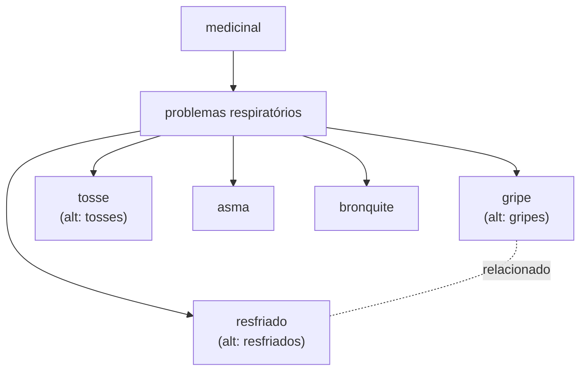

# 9. Exemplo completo, do início ao fim {#s9}

Este grupo foi curado de verdade em 2026-08-07, e o resultado está no ar. A coleta trouxe estes
candidatos soltos do `tipoUso.txt`: `gripe`, `gripes`, `gripe e tosse`, `gripe e resfriado`,
`tosse`, `tosses`, `asma e tosse`, `resfriado`, `resfriados`, `asma`, `bronquite`,
`problemas respiratórios`.

**Decisões de curadoria:**

1. **`problemas respiratórios`** vira o conceito guarda-chuva.
   - Definição: "Uso medicinal no tratamento de afecções do sistema respiratório."
   - Mais amplo → `medicinal`.

2. **`gripe`** vira um conceito.
   - prefLabel: `gripe` (por, público).
   - altLabel: `gripes` (plural — **mesmo conceito**, não crie outro).
   - Mais amplo → `problemas respiratórios`.
   - Relacionado → `resfriado` (associados, mas distintos).

3. **`resfriado`** vira um conceito.
   - prefLabel: `resfriado`; altLabel: `resfriados` (plural).
   - Mais amplo → `problemas respiratórios`.

4. **`tosse`** vira um conceito.
   - prefLabel: `tosse`; altLabel: `tosses`.
   - Mais amplo → `problemas respiratórios`.

5. **`gripe e tosse`** e **`gripe e resfriado`** são termos **compostos** que a coleta capturou
   como um só. Nenhum dos dois é um conceito novo: são co-ocorrências de conceitos que já temos.
   O que a curadoria realmente fez, e o que este manual passa a mandar fazer ([§7.4](07-guia-de-decisao.md#s7-4)):
   rótulo **oculto em `gripe` e em `tosse`** (para `gripe e tosse`), com a depreciação apontando
   `gripe`; rótulo **oculto em `gripe` e em `resfriado`** (para `gripe e resfriado`), com a
   depreciação também apontando `gripe`. Apontar só um dos dois conceitos apagaria metade do
   registro — não use "ou tratá-lo como rótulo oculto de `gripe`" como alternativa: são as **duas**
   coisas, sempre.

6. **`asma`** e **`bronquite`** viram conceitos, ambos com Mais amplo → `problemas respiratórios`.
   `asma e tosse` é composto do mesmo jeito que o item 5: oculto em `asma` e em `tosse`,
   depreciado apontando `asma`.

Resultado: em vez de doze termos soltos, temos uma pequena árvore navegável e sem duplicatas —
com plurais recolhidos como rótulos, três termos compostos resolvidos ([§7.4](07-guia-de-decisao.md#s7-4)),
e as associações certas.

Números reais de cada conceito do grupo: `problemas respiratórios` absorveu 7 termos
(`doenças respiratórias`, `problemas pulmonares`, `pulmão`, `respiratório`, `trato respiratório`,
`problemas nas vias respiratórias`, `problemas no pulmão`) e tem **14 filhos**; `tosse` absorveu 7
(`tosses`, `cough`, `aliviar tosses`, `tosse forte`, `tosse calmante`, `asma e tosse`,
`gripe e tosse`); `gripe` absorveu 5 (`gripes`, `flu`, `prevenir a gripe`, `gripe e tosse`,
`gripe e resfriado`); `asma` absorveu 4 (`asma brônquica`, `curar a asma`, `tratar e curar a asma`,
`asma e tosse`).

**A prova pública.** Depois de ativada, a curadoria responde às buscas na consulta pública com a
regra que cada uma exercita:

| Busca | Devolve | Regra |
|---|---|---|
| `headache` | `dor de cabeça` | termo em inglês → `alt`/`eng` |
| `diarréia` | `diarreia` | grafia incorreta → oculto, invisível mas buscável |
| `stomache` | `dor no estômago` | variante de regência + inglês |
| `gripes` | `gripe` | plural → `alt` |
| `tranquilizante` | `sedativo`, `calmante` | absorção + nota de escopo da fronteira |
| `GET` do id de `gripes` | `410` com `replacedBy` = `gripe` | conceito absorvido responde com a lápide certa |
