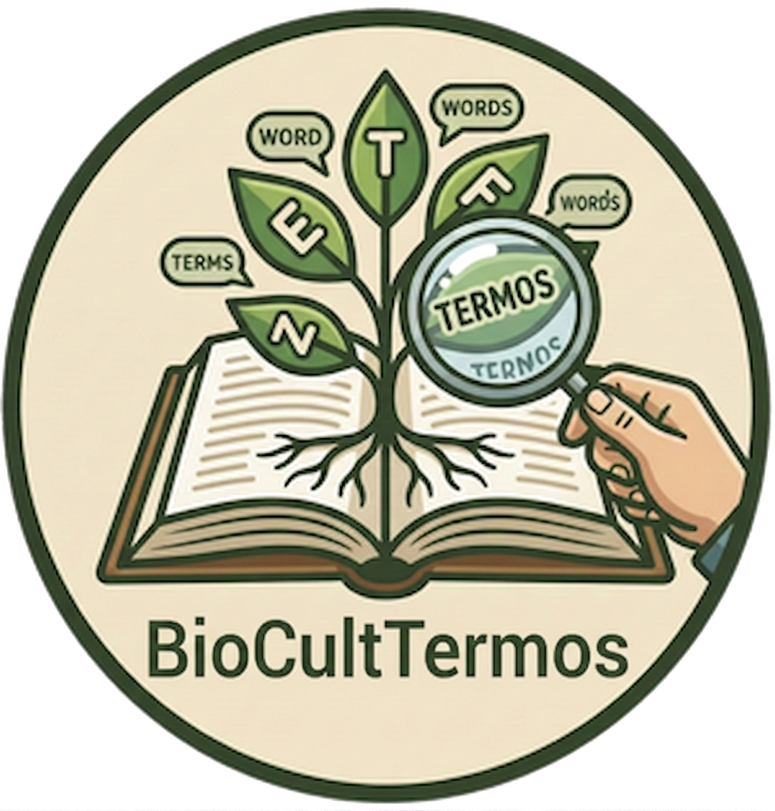

  

# Manual de Curadoria do BioCultTermos

### Um guia didático de SKOS-XL para o Conhecimento Tradicional Associado à Biodiversidade

> Este manual é para **curadores** do BioCultTermos. Não pressupõe conhecimento prévio de
> ontologias ou Web Semântica. A ideia é que, ao final, você saiba **por que** o sistema é
> organizado do jeito que é e **como** tomar as decisões certas na tela de edição de conceitos.
>
> Todos os exemplos vêm da curadoria real do Campo Semântico "Tipos de Usos de Plantas",
> executada em produção em 2026-08-07: 713 termos crus reduzidos a 333 conceitos vivos (305
> ativos). A lista de origem, [`tipoUso.txt`](https://github.com/edalcin/BioCultDB/blob/main/docs/referencia/tipoUso.txt),
> é o corpus que o BioCultDB coleta da literatura científica e entrega ao BioCultTermos para
> curadoria.

## Capítulos

| # | Capítulo | O que resolve |
|---|---|---|
| 1 | [O problema](01-o-problema.md) | Por que termos crus e soltos não respondem perguntas simples como "quais plantas tratam problemas respiratórios?" |
| 2 | [Termo × Conceito](02-termo-e-conceito.md) | A distinção fundamental entre uma string coletada e uma unidade de significado curada. |
| 3 | [Rótulos (SKOS-XL)](03-rotulos.md) | Os três tipos de rótulo, idioma, Nível de Acesso (CARE) e proveniência. |
| 4 | [Definição e Notas](04-definicao-e-notas.md) | Os quatro campos que descrevem o conceito como um todo — e onde não escrever definição. |
| 5 | [Ciclo de vida](05-ciclo-de-vida.md) | Candidato, ativo, depreciado — e o que a aquisição faz com o seu trabalho. |
| 6 | [Relações semânticas](06-relacoes-semanticas.md) | Hierarquia, relacionado, sinônimo — e a diferença entre indicação terapêutica e ação farmacológica. |
| 7 | [Guia de decisão](07-guia-de-decisao.md) | O fluxo completo, com os casos de termo composto e qualificador entre parênteses. |
| 8 | [Passo a passo na tela](08-passo-a-passo.md) | O percurso típico ao curar um conceito candidato, do primeiro olhar à ativação. |
| 9 | [Exemplo completo](09-exemplo-completo.md) | O grupo respiratório curado de ponta a ponta, com a prova pública do resultado. |
| 10 | [Curando um Campo Semântico inteiro](10-campo-semantico-inteiro.md) | O método das cinco fases para curar um campo inteiro, não só um conceito. |
| 11 | [Erros comuns](11-erros-comuns.md) | O que não fazer, com o erro real da campanha ao lado da prática correta. |
| 12 | [Glossário](12-glossario.md) | Referência rápida dos termos usados neste manual. |

---

> **Padrão de referência:** [W3C SKOS-XL](https://www.w3.org/TR/skos-reference/skos-xl.html) ·
> [Princípios CARE](https://www.gida-global.org/care) ·
> [Darwin Core (TDWG)](https://dwc.tdwg.org/) ·
> [Protocolo de Nagoya](https://www.cbd.int/abs/)
>
> Este manual documenta o comportamento atual da tela de edição do BioCultTermos. As caixas de
> ajuda (**?**) dentro do sistema trazem versões resumidas destes mesmos conceitos. O registro
> completo da campanha que originou os exemplos está em
> [`docs/curadoria/tipos-de-uso`](https://github.com/edalcin/BioCultDB/tree/main/docs/curadoria/tipos-de-uso).
